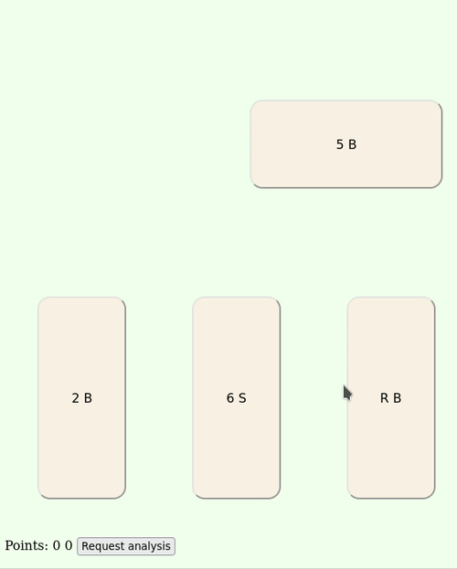

# Card games

This is a simple prototype of a card game analysis tool.
Currently it implements only the Italian game of
[briscola](https://en.wikipedia.org/wiki/Briscola).

Launching the main server program and connecting to it
with a browser, you can play a game of briscola against
the computer (who will be a very weak player as it will
choose randomly a card to play).

While playing, it is possible to ask for a game analysis.
The server will estimate the probability of winning the
game for each card in the player's hand by running a
Monte Carlo search in the space of all possible games
issuing from the current state of the game. This space
is huge and currently the search engine will sample a
tiny part of it, therefore it will not give very good
playing advice.

Example:

## Usage
Compile the server with `make server`. Then launch it
with: `./server <ip address> <port> .`
For example to play on the same machine where the server
is run, use: `./server 127.0.0.1 8000 .`
If you want the server to be visible to all machines in
your LAN, find the server's ip address with `ip addr`,
then launch the server with: `./server <inet address> <port> .`

## Components
- The html page with the game (`briscola.html`) and some
  Javascript code used to simulate the gaming table and
  to keep track of the game state.
- A web server (`server.cc`) that serves the html page
  and can accept game analysis requests from the player.
- A game evaluation module (`mcengine.hh`) that given
  the current state of the game returns an estimate of
  the winning probabilities for each card in the player's
  hand.

## Future work
- The game analysis is very naive and could easily be
  improved (for example, by encoding some simple rules
  that any human player would use to quickly avoid
  obviously bad moves).
- There is too much javascript in the front end. I would
  like to move the game state management to the back end
  and leave only the interaction part in javascript.

